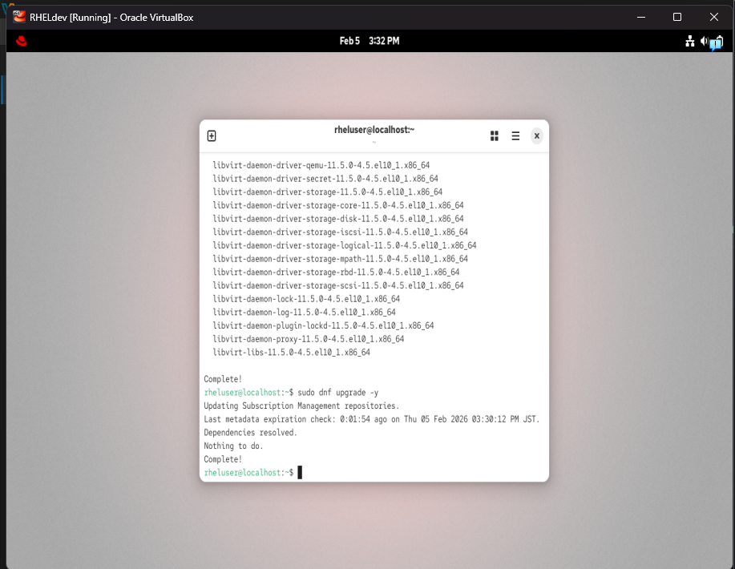
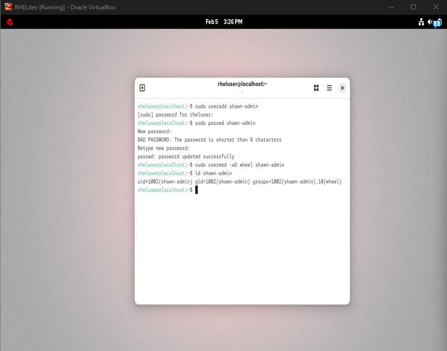
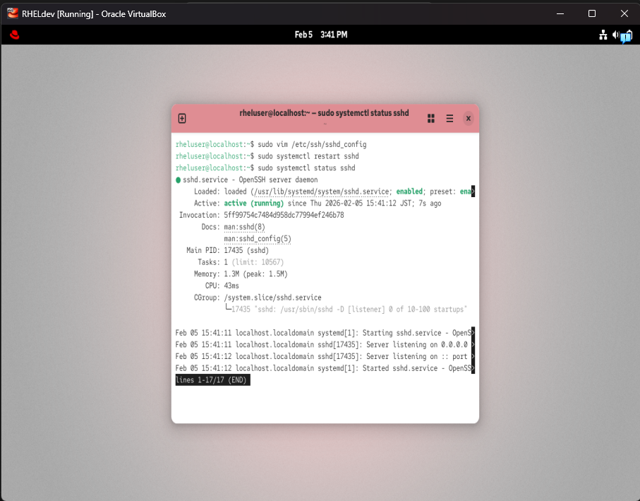
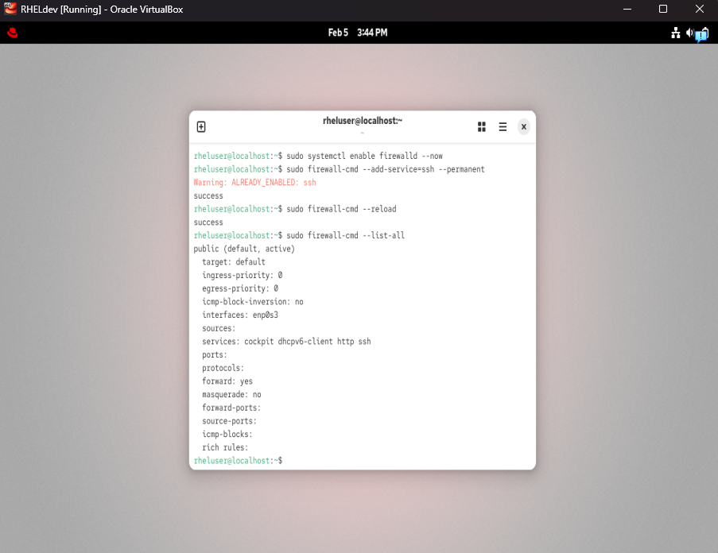
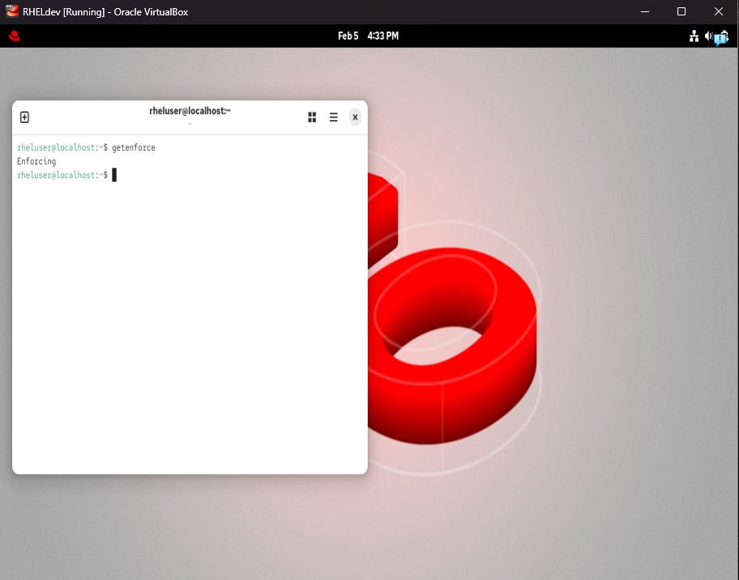
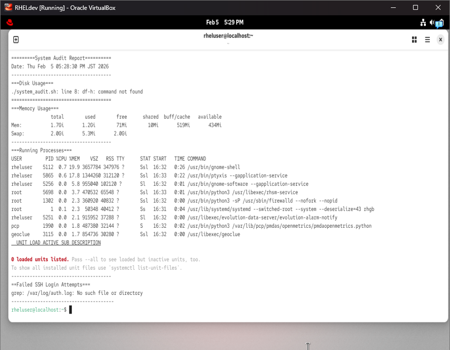

# RHEL 10 Server Hardening Lab

This project demonstrates the setup and hardening of a Red Hat Enterprise Linux 10 server running in VirtualBox. The goal is to apply foundational security practices used in enterprise Linux environments, document the process clearly for infrastructure and cybersecurity roles.

---

## 1. Environment Details

- **Virtualization:** VirtualBox 7.x  
- **Operating System:** RHEL 10 (Developer Subscription)  
- **VM Specs:** 2 vCPUs, 4GB RAM, 20GB disk  
- **Networking:** NAT  
- **Purpose:** Create a hardened baseline server configuration suitable for enterprise environments  

---

## 2. Hardening Steps Performed

### 2.1 System Updates

Applied all available system updates to ensure the server is fully patched.

**Commands Used**

sudo dnf update -y sudo dnf upgrade -y

**Screenshot**  

---

### 2.2 User & Group Management

Created a non-root administrative user and assigned them to the `wheel` group to follow the principle of least privilege.

**Commands Used**

sudo useradd shawn-admin 
sudo passwd shawn-admin 
sudo usermod -aG wheel shawn-admin

**Verification**

id shawn-admin

**Screenshot**  

---

### 2.3 SSH Hardening

Configured SSH to improve security by disabling root login, disabling password authentication, and enforcing key-based authentication.

**Changes Made in `/etc/ssh/sshd_config`:**

PermitRootLogin no 
PasswordAuthentication no PubkeyAuthentication yes 
Port 22

**Commands Used**

sudo systemctl restart sshd sudo systemctl status sshd

**Screenshot**  

**Configuration File**  
See: `configs/sshd_config`

---

### 2.4 Firewall Configuration (firewalld)

Enabled and configured firewalld to allow only necessary services.

**Commands Used**

sudo systemctl restart sshd
sudo systemctl status sshd

**Screenshot**  

**Configuration File**  
See: `configs/sshd_config`

---

### 2.4 Firewall Configuration (firewalld)

Enabled and configured firewalld to allow only necessary services.

**Commands Used**

sudo systemctl enable firewalld --now
sudo firewall-cmd --add-service=ssh --permanent
sudo firewall-cmd --reload
sudo firewall-cmd --list-all

**Screenshot**  

**Configuration Output**  
See: `configs/firewalld_rules.txt`

---

### 2.5 SELinux Configuration

Ensured SELinux is running in enforcing mode for mandatory access control.

**Commands Used**

getenforce
sudo vim /etc/selinux/config

**Verification**

getenforce

**Screenshot**  

---

### 2.6 System Audit Script

Created a Bash script to generate a basic system audit report including disk usage, memory usage, running services, and failed SSH login attempts.

**Script Location**  
`scripts/system_audit.sh`

**Commands Used**

chmod +x system_audit.sh
./system_audit.sh

**Screenshot**  

---

## 3. Screenshots

All screenshots used in this project are stored in the `/screenshots` directory.

- `rhelhardeningdnfupdateandupgrade.png`  
- `rhelhardeningfirewall.png`  
- `rhelhardeninggetenforce.png`  
- `rhelhardeningscriptresult.png`  
- `rhelhardeningsshdconfig.png`  
- `rhelhardeningsystemreport.png`
- `rhelhardeninguseradd.png`  

---

## 4. Configuration Files

All configuration files and command outputs are stored in the `/configs` directory.

- `sshd_config`  
- `firewalld_rules.txt`  
- `user_list.txt`  

---

## 5. Commands Used (Full List)

sudo useradd shawn-admin
sudo passwd shawn-admin
sudo usermod -aG wheel shawn-admin

sudo dnf update -y
sudo dnf upgrade -y

sudo vim /etc/ssh/sshd_config
sudo systemctl restart sshd
sudo systemctl status sshd

sudo systemctil enable firewalld --now
sudo firewall-cmd --add-service=ssh --permanent sudo firewall-cmd --reload
sudo firewall=cmd --list-all

getenforce
sudo vim /etc/selinux/config
sudo reboot

chmod +x system_audit.sh
./system_audit.sh

---

## 6. Lessons Learned

- Importance of least-privilege access and avoiding root login  
- How SELinux enforces mandatory access control  
- How to secure SSH in a production-like environment  
- How firewalld manages zones and services  
- Value of documenting system changes for reproducibility  
- Demonstrating a professional RHEL setup for IT readiness 

---

## 7. Future Improvements

- Add fail2ban for SSH intrusion prevention  
- Configure automatic security updates  
- Add log forwarding to a remote syslog server  
- Add monitoring (Nagios, Zabbix, or Prometheus)  
- Automate hardening steps using Ansible  
- Add CIS benchmark compliance checks  

---

## 8. Project Status

**Completed:** Initial hardening, documentation, and audit script  
**Next Steps:** Add automation and monitoring components  