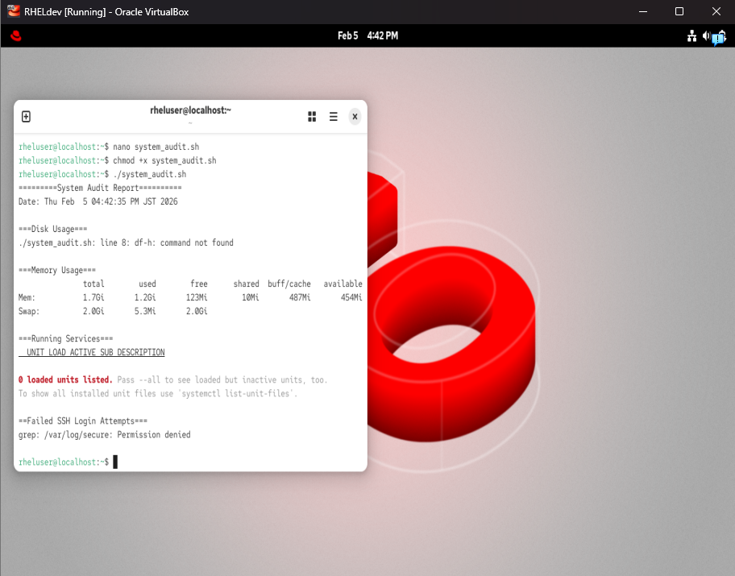

# Screenshots

This page explains each screenshot included in the `/screenshots` directory and how it relates to the hardening process.

---

## System Preparation

  
System updated using `dnf update` and `dnf upgrade` to ensure the baseline is applied to a fully patched environment.

  
SELinux status checked using `getenforce` to confirm the system is enforcing or permissive before applying hardening steps.

---

## User and Access Management

  
Creation of a non-root administrative user to support secure SSH access and avoid direct root login.

---

## SSH Hardening

  
Updated `/etc/ssh/sshd_config` showing hardened SSH settings such as disabling root login and password authentication.

---

## Firewall Configuration

  
`firewall-cmd --list-all` output confirming that firewalld is active and only required services are exposed.

---

## System Validation

  
System report summarizing the state of key services and configurations after applying the hardening baseline.

  
Output from the hardening script showing successful application of SSH, firewall, and sysctl changes.

---